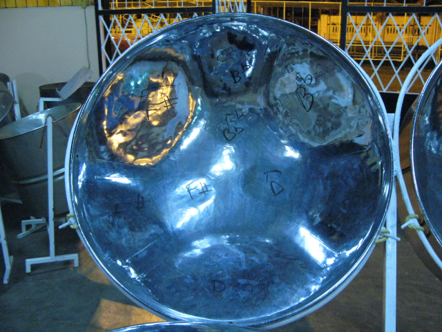

===============
DACARYH Project
===============

Data science for the study of Calypso-rhythm through history (DaCaRyH)
======================================================================

DaCaRyH (Data science for the study of calypso-rhythm through history) is a joint Project of `AHRC Care for the Future: Thinking 
Forward through the Past<http://passes-present.eu/>`_ and `The Cluster of Excellence 
LABEX Pasts in the Present: History, Heritage, Memory<http://passes-present.eu/>`_.

DaCaRyH is a collaboration of ethnomusicologists and archivists in France, and data scientists and composers in the UK.

Principal Investigators
~~~~~~~~~~~~~~~~~~~~~~~
- Aurélie HELMLINGER , Ethnomusicologist , Laboratoire d'Ethnologie et de Sociologie Comparative, UMR 7186 - CREM
- Bob STURM , Lecturer in Digital Media , Queen Mary University of London

Team
~~~~
-  UK
  - Bob L. Sturm, PI (C4DM, QMUL)
  - Elio Quinton (C4DM, QMUL)
  - Oded Ben-Tal (Kingston University)

- FRANCE
  - Aurelie Helmlinger, PI (CREM-LESC, CNRS, Nanterre)
  - Florabelle Spielmann (CREM-LESC, CNRS, Nanterre)
  - Joséphine Simonnot (CREM-LESC, CNRS, Nanterre)
  - Guillaume Pellerin (Parisson)
  - Thomas Fillon (Parisson)

  
Associated partners
~~~~~~~~~~~~~~~~~~~
- `Centre de Recherche en Ethnomusicologie (CREM) <http://crem-cnrs.fr/archives-sonores>`_. 
- `Queen Mary University of London (QMUL) <http://www.qmul.ac.uk/>`_
- `Parisson <http://www.parisson.com/>`_

The audio archives of the CNRS – Musée de l’Homme gather commercial and unpublished recordings of music and oral traditions from around the world, from 1900 to the present.  Consisting of diverse types of media (wax cylinders, 78 rpm, vinyl records, magnetic tapes, audio CDs, born digital records), these archives are among the most important in Europe in terms of quality, quantity and diversity.

For a historical presentation of these archives, see `the website of the CREM <http://crem-cnrs.fr>`_.

        
 Quadrophonic, dr02, Birdsong - © Aurélie Helmlinger 
  

Description of the project
~~~~~~~~~~~~~~~~~~~~~~~~~~

DaCaRyH is a collaboration of ethnomusicologists and archivists in France, and data scientists and composers in the UK. DaCaRyH has 3 objectives:
- to enrich the domain of ethnomusicology by integrating data science and music information retrieval (MIR) methods into ethnomusicological archives and research practices;
- to enrich the domains of data science and MIR by integrating ethnomusicological use cases into the practice of the research and development of intelligent 
   systems;
   - to study the concept of musical style through a comparative diachronic analysis of a music corpus, and to transform the features extracted from the same corpus into new styles.
     
     DaCaRyH is aligned primarily with "*The Digital Age* and its effects on tangible and intangible heritage", and secondarily with "representations and uses of the past." DaCaRyH will work specifically with the music tradition of the steel band calypso. This provides focus on a variety of real and challenging ethnomusicological questions, which in turn drive the development of data science and MIR technologies. DaCaRyH helps pave the way to "big cultural data," or the analysis of human culture at scales not possible without computational methods.

     DaCaRyH involves the Research Center for Ethnomusicology (CREM-LESC, France), and the Centre for Digital Music (C4DM, Queen Mary University of London, UK). CREM-LESC offers access to a large ethnomusicologic recordings database accessible worldwide throug
h an online platform. C4DM is a world-leading group of specialists in data science applied to music. DaCaRyH will result in: two journal submissions (one in the respective fields of the PIs), a call for a special journal issue concerning cultural studies a
nd data science, a music composition and performance project  involving the use of the tools developed in DaCaRyH, and improved functionality integrated with the CREM-LESC ethnomusicological recordings archive.
