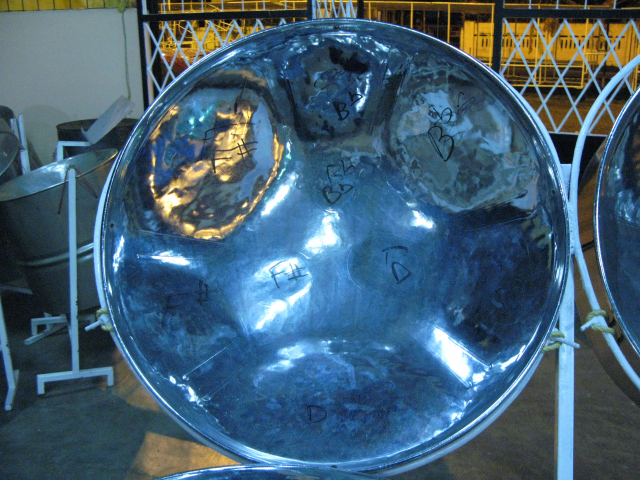

==============
Projet DACARYH
==============

Étude analytique du rythme calypso à travers l'histoire
=======================================================

Le projet DaCaRyH est un projet franco-britannique développé grâce au partenariat entre le labex `Les passés dans le présent <http://passes-present.eu/>`_ en France et le programme `Care for the Future, du Arts & Humanities Research Council <http://careforthefuture.exeter.ac.uk/>`_ au Royaume-Uni.

Portant sur la tradition musicale du calypso de Trinidad, reposant sur une collaboration entre ethnomusicologues et archivistes français, scientifiques du traitement de données et compositeurs britanniques, le projet se propose d’enrichir la discipline de l’ethnomusicologie en intégrant l’informatique et la recherche d’informations dans la musique (MIR) pour les archives sonores et les pratiques de recherche. Il vise également à enrichir les sciences de l’information et des MIR en intégrant des exemples ethnomusicologiques dans les recherches et le développement de systèmes intelligents. Il se propose enfin d’étudier à partir des « Big Data » culturelles, le concept de style musical à travers une analyse diachronique comparative d'un corpus de musique styles et d’analyser le patrimoine culturel à grande échelle.

Responsables du projet
~~~~~~~~~~~~~~~~~~~~~~

- Aurélie HELMLINGER , Ethnomusicologue , Laboratoire d'Ethnologie et de Sociologie Comparative, UMR 7186 - CREM
- Bob STURM , Lecturer in Digital Media , Queen Mary University of London

Équipe
~~~~~~

- Royaume-Uni

  - Bob L. Sturm, PI (C4DM, QMUL)
  - Elio Quinton (C4DM, QMUL)
  - Oded Ben-Tal (Kingston University)

- France

  - Aurelie Helmlinger, PI (CREM-LESC, CNRS, Nanterre)
  - Florabelle Spielmann (CREM-LESC, CNRS, Nanterre)
  - Joséphine Simonnot (CREM-LESC, CNRS, Nanterre)
  - Guillaume Pellerin (Parisson)
  - Thomas Fillon (Parisson)

  

Partenaires associés
~~~~~~~~~~~~~~~~~~~~
- `Centre de Recherche en Ethnomusicologie (CREM) <http://crem-cnrs.fr/archives-sonores>`_. 
- `Queen Mary University of London (QMUL) <http://www.qmul.ac.uk/>`_
- `Parisson <http://www.parisson.com/>`_

Le fonds d’archives sonores du CNRS – Musée de l’Homme rassemble des enregistrements, inédits ou publiés, de musique de tradition orale et d'enquêtes ethnographiques du monde entier, de 1900 à nos jours. Constitué de supports variés (cylindres, 78 tours, disques vinyles, bandes magnétiques, cassettes, CDs audios, DVD, supports numériques), ce fonds se positionne parmi les plus importants d’Europe en terme de qualité, de quantité et de diversité.

Pour une présentation historique du fonds, voir `le site du CREM <http://crem-cnrs.fr/archives-sonores>`_. 

        
.. image legend : Quadrophonic, dr02, Birdsong - © Aurélie Helmlinger 

 
Description du projet
~~~~~~~~~~~~~~~~~~~~~
Le projet DaCaRyH (Etude analytique du rythme calypso à travers l'histoire) est une collaboration entre ethnomusicologues et archivistes français, scientifiques du traitement de données et compositeurs britanniques, avec 3 objectifs :
- enrichir la discipline de l’ethnomusicologie en intégrant l’informatique et la recherche d’informations dans la musique (Music Information Retrieval - MIR) pour les archives sonores et les pratiques de recherche;
- enrichir les sciences de l’information et des MIR en intégrant des exemples ethnomusicologiques dans les 
recherches et le développement de systèmes intelligents; 3
- étudier le concept de style musical à travers une analyse diachronique comparative d'un corpus de musique et transformer les caractéristiques extraites du même corpus dans de nouveaux styles.
  
"L'ère numérique et ses effets sur le patrimoine matériel et immatériel" est le thème le plus représentatif, ainsi que les "Représentations et usages du passé." DaCaRyH étudiera en particulier la tradition musicale du calypso de Trinidad et se focalisera sur des questions ethnomusicologiques concrètes et difficiles, qui nécessitent une aide des technologies MIR. 

DaCaRyH va contribuer à ouvrir la voie aux "Big Data" culturelles et à l'analyse du patrimoine culturel à grande échelle, impossible sans calcul. Sont impliqués le Centre de Recherche pour l'Ethnomusicologie (CREM - LESC, France), et le Centre for Digital Music (C4DM, Queen Mary University, Royaume-Uni). 
Le CREM-LESC offre un accès à une grande base audio accessible par tous grâce à une plateforme web. 
C4DM est leader mondial en sciences de l’information pour la musique. 

DaCaRyH se traduira par 2 propositions d’articles, dans les domaines respectifs de chaque porteur, une proposition de numéro spécial d’une revue concernant les études culturelles et les sciences, une composition musicale et un concert impliquant l'utilisation des outils développés dans DaCaRyH, ainsi qu’une amélioration des outils intégrés dans la plateforme web des archives du CREM-LESC. 

